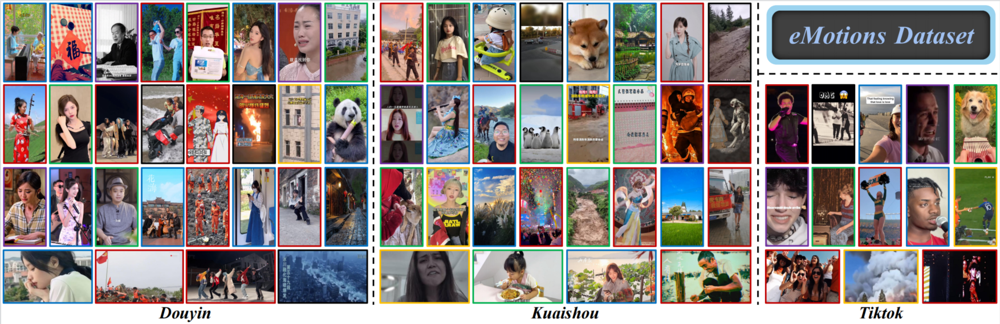

# eMotions
Official repository for ***eMotions: A Large-Scale Dataset for Emotion Recognition in Short Videos***.

## 🎯 Overview

<p align="center">
  
</p>

---


## 🏆 Contributions
- To our knowledge, eMotions is the first dataset for emotion recognition in SVs. The more reliable annotated emotions can promote future studies in this field.  
- We propose an effective baseline AV-CPNet to recognize the emotions in SVs. We design the corresponding components to complementarily model the audio-visual correlations and leverage the emotion-polarity information to better guide model optimization.
- Extensive experimental results on nine datasets verify the superiority of our proposed model and provide detailed insights into different approaches and modalities for future works.
  
---

## 🙏 Acknowledgements 

eMotions and its two variants will not be transferred to outside parties without permissions and can be utilized only for academic research purposes. In particular, the datasets will not be included as part of any commercial software package or product of any institution.

---

## 📜 Citation

If you find eMotions useful for your research and applications, please cite using the following BibTeX:

```bibtex
  @article{wu2023emotions,
  title={eMotions: A Large-Scale Dataset for Emotion Recognition in Short Videos},
  author={Wu, Xuecheng and Sun, Heli and Xue, Junxiao and Zhai, Ruofan and Kong, Xiangyan and Nie, Jiayu and He, Liang},
  journal={arXiv preprint arXiv:2311.17335},
  year={2023}
  }
```

---


