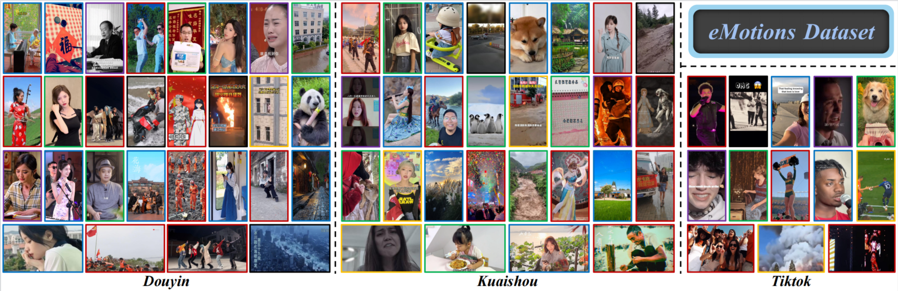

# eMotions

Official repository for **eMotions: A Large-Scale Dataset for Emotion Recognition in Short Videos**.

<p align="center">
  
</p>

## Overview

eMotions is a large-scale benchmark for emotion recognition in short-form videos. The repository provides dataset information, access instructions, and the AV-CANet baseline code used for audio-visual emotion recognition experiments.

## Contributions

- We introduce eMotions, a large-scale short-video emotion recognition dataset.
- We provide an audio-visual baseline for modeling visual, acoustic, and cross-modal affective cues.
- We report systematic experiments and analysis for short-form video emotion recognition.

## Dataset Access

The dataset is hosted on HuggingFace:

https://huggingface.co/datasets/Conna/eMotions

Dataset files are not stored in this GitHub repository. Please follow the HuggingFace dataset card for access, usage terms, and download instructions.

## AV-CANet Baseline

The `AV-CANet/` directory contains the audio-visual baseline code for eMotions.

```text
AV-CANet/
├── main_final_delay.py       # training and test entry point
├── infer_emotions_val.py     # validation/inference script
├── opts.py                   # command-line options
├── models/                   # audio, visual, and fusion modules
├── core/                     # training utilities, losses, and model factory
├── datasets/                 # eMotions-style dataset loader
├── transforms/               # spatial, temporal, and target transforms
└── tools/                    # preprocessing helpers
```

### Installation

```bash
cd AV-CANet
conda create -n avcanet python=3.8 -y
conda activate avcanet
pip install -r requirements.txt
```

Install the PyTorch/CUDA build that matches your machine. `ffmpeg` is required for video and audio preprocessing.

### Expected Data Layout

After downloading and preprocessing eMotions, use a local layout similar to:

```text
AV-CANet/
  eMotions_all_processed/
    eMotions_imgs/<class>/<video_id>/000001.jpg ... n_frames
    eMotions_mp3/<class>/<video_id>.mp3
  annotations/eMotions6_01_all.json
```

The dataset, annotation JSON files, split files, generated features, checkpoints, and logs are excluded from git.

### Preprocessing

Extract frames:

```bash
python tools/video2jpg.py \
  --input_dir /path/to/eMotions/video_raw \
  --output_dir eMotions_all_processed/eMotions_imgs
```

Extract audio:

```bash
python tools/video2mp3.py \
  --input_dir /path/to/eMotions/video_raw \
  --output_dir eMotions_all_processed/eMotions_mp3
```

Generate `n_frames` files:

```bash
python tools/n_frames.py \
  --frame_dir eMotions_all_processed/eMotions_imgs
```

Generate annotation JSON from split files:

```bash
python tools/eMotions6_json.py \
  --csv_dir /path/to/split_txt_dir \
  --split_index 1 \
  --output annotations/eMotions6_01_all.json
```

### Training

```bash
python main_final_delay.py \
  --root_path . \
  --video_path eMotions_all_processed/eMotions_imgs \
  --audio_path eMotions_all_processed/eMotions_mp3 \
  --annotation_path annotations/eMotions6_01_all.json \
  --video_pretrained pretrained/swin_tiny_patch4_window7_224_22k.pth \
  --result_path results \
  --expr_name avcanet_emotions \
  --mode train
```

### Inference

```bash
python infer_emotions_val.py \
  --root_path . \
  --video_path eMotions_all_processed/eMotions_imgs \
  --audio_path eMotions_all_processed/eMotions_mp3 \
  --annotation_path annotations/eMotions6_01_all.json \
  --checkpoint_path /path/to/checkpoint.pth \
  --save_dir results/inference_eMotions6_val
```

## Usage Notes

- The baseline code is released for academic research and reproducibility.
- The dataset must be downloaded separately from HuggingFace.
- Do not commit raw videos, extracted frames, audio files, annotations, checkpoints, or generated results.

## Acknowledgements

eMotions and its variants are provided for academic research. Please follow the dataset usage terms described on the HuggingFace dataset page.

## Citation

If you find eMotions useful for your research, please cite:

```bibtex
@inproceedings{wu2025towards,
  title={Towards Emotion Analysis in Short-Form Videos: A Large-Scale Dataset and Baseline},
  author={Wu, Xuecheng and Sun, Heli and Xue, Junxiao and Nie, Jiayu and Kong, Xiangyan and Zhai, Ruofan and Huang, Danlei and He, Liang},
  booktitle={Proceedings of the 2025 International Conference on Multimedia Retrieval},
  pages={1497--1506},
  year={2025}
}
```
